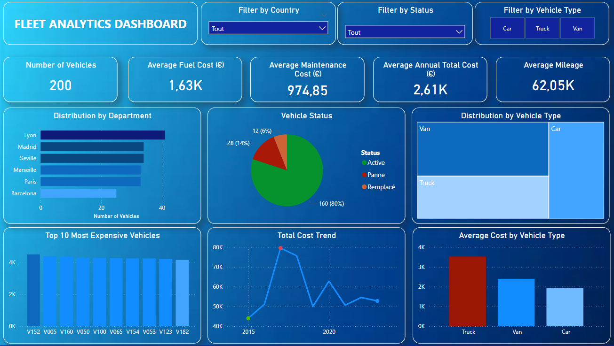

# 👋 Tony Aires
### Data Analyst · Operations & Business Performance

*Turning operational data into business-driven insights*

[🇫🇷 French](#) · [🇬🇧 English](#) · [🇪🇸 Spanish](#) · [🇵🇹 Portuguese](#)

---

## 📑 Table of Contents

- [About Me](#-about-me)
- [Professional Background](#-professional-background)
- [Data Analytics Focus](#-data-analytics-focus)
- [Projects Portfolio](#-projects-portfolio)
- [Technical Skills](#️-technical-skills)
- [Languages](#-languages)
- [Career Objective](#-career-objective)

---

## 🎯 About Me

Data Analyst certified by **Sorbonne University** (Master's level equivalent), with a strong background in **operations management, fleet optimization, and business performance analysis** within an international environment.

With **6 years of experience** in a multinational pharmaceutical group (**AbbVie**), I developed a data-driven approach to decision-making, focusing on cost optimization, KPI monitoring, and performance reporting.

Today, I specialize in transforming complex datasets into **actionable business insights** using Python, SQL, and Power BI.

---

## 💼 Professional Background

Previously working in **fleet and operations management**, my role was heavily data-oriented:

| Area | Scope |
|------|-------|
| 🚗 **Fleet Management** | 540-vehicle fleet across Europe |
| 💰 **Budget Oversight** | €5M+ operational budget |
| 📊 **Reporting** | KPI design & automated reporting systems |
| 🔍 **Cost Analysis** | Variance tracking & supplier performance monitoring |
| 🌍 **International Scope** | Europe & Global HQ coordination |

> My role progressively evolved into a **data-centric decision support function**, bridging operations and analytics.

---

## 🔬 Data Analytics Focus

---

## 🚀 Projects Portfolio

## 📊 Dashboard Preview

## ⭐ Featured Projects

### 📊 Eurofood — Customer & Sales Analytics
RFM segmentation · loyalty analysis · profitability insights  
**Python · SQL · Power BI**

🔗 [View Project →](https://github.com/tonyaires/Eurofood-Corp-Sales-Customer-Analytics)

---

### 🚛 Fleet Analytics
Cost optimization across 200 vehicles (France & Spain)  
**Python · SQL · Power BI**  
→ Identified key cost drivers (vehicle type, geography)

🔗 [View Project →](https://github.com/tonyaires/Fleet-Management-Cost-Optimization-Analysis)

---

### ⚡ Supply Chain Risk Prediction
ML model for stockout risk scoring (ROC-AUC: 0.626)  
**Python · Scikit-learn · Power BI**  
→ Risk prioritization system for operations

🔗 [View Project →](https://github.com/tonyaires/Global-Tech-Supply-Chain-Risk-Prediction)

---

## 📁 Additional Project

### ⚡ ENEDIS Energy Analytics
Renewable energy dashboard across France  
**Power BI · Data Modeling · DAX**  
→ Regional performance & solar efficiency analysis

🔗 [View Project →](https://github.com/tonyaires/ENEDIS-Renewable-Energy-Analytics-Dashboard)

---

## 🛠️ Technical Skills

### Data Analysis
| Tool | Skills |
|------|--------|
| 🐍 **Python** | Pandas · NumPy · Seaborn · Matplotlib |
| 🗄️ **SQL** | Joins · CTEs · Window functions · Aggregations |
| 📊 **Power BI** | DAX · Power Query · Data Modeling |
| 📑 **Excel** | Pivot tables · Power Query · XLOOKUP · INDEX/MATCH · Dashboards |

### Data Science
- 🤖 Machine Learning (classification models)
- 🧪 Feature engineering
- 📐 Model evaluation & threshold tuning

### Business & Analytics
- 📈 KPI design & reporting
- 💰 Cost optimization
- 🔄 Operational reporting
- 🎯 Data-driven decision making

---

## 🌍 Languages

| Language | Level |
|----------|-------|
| 🇫🇷 French | **Native** |
| 🇬🇧 English | **Fluent** |
| 🇪🇸 Spanish | **Fluent** |
| 🇵🇹 Portuguese | **Fluent** |

---

## 🎯 Career Objective

> Seeking a **Data Analyst / Analytics role** *(full remote or international)* where I can leverage my experience in **operations and data analytics** to deliver **business-driven insights and measurable impact**.

---

### 📫 Let's connect

⭐ *Feel free to explore my projects and reach out!*

**Made with 💼 by Tony Aires**

